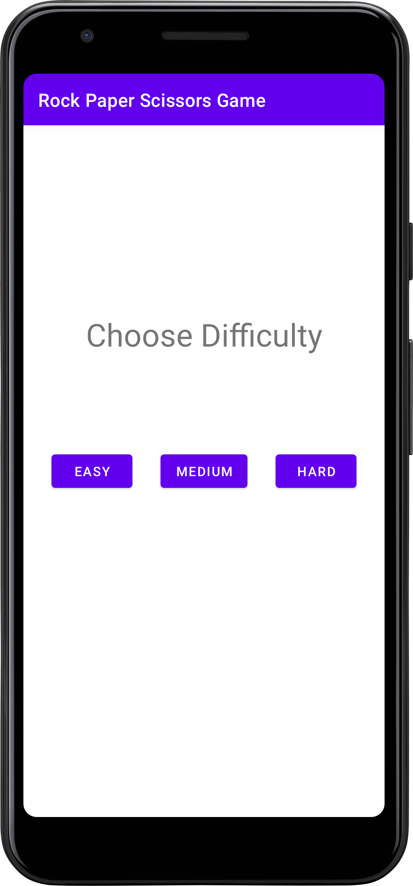
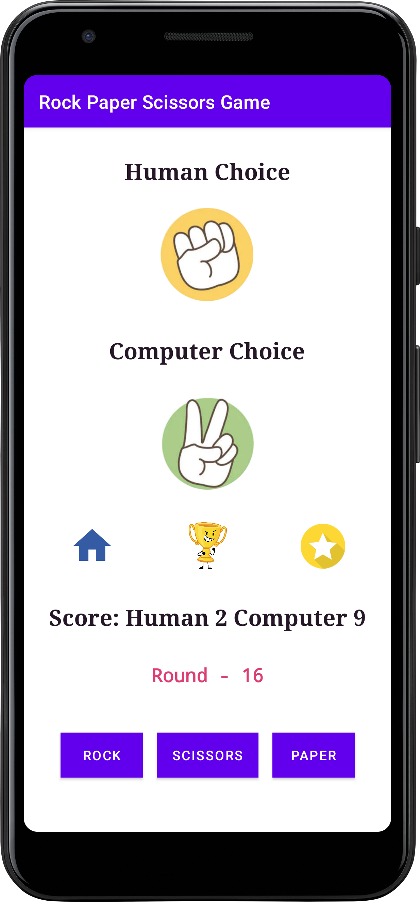

# Rock Paper Scissors

Welcome to the Rock, Paper, Scissors App! This Android application allows you to play the classic
game of Rock, Paper, Scissors against an AI opponent. The game includes different difficulty levels
and keeps track of your score.

## Features

- Play Rock, Paper, Scissors against an AI opponent.
- Choose from different difficulty levels: easy, medium, and hard.
- Track your wins, draws, and losses.
- View your overall score and round number.
- Enjoy visual representations of your choices and game outcomes.

## Installation

1. Clone the repository to your local machine.

    ```bash
    git clone https://github.com/Hardvan/Rock-Paper-Scissors-Android-App.git
    ```

2. Open the project in Android Studio.

3. Build and run the app on an Android emulator or physical device.

4. Choose a difficulty level and start playing the game!

## Screenshots




